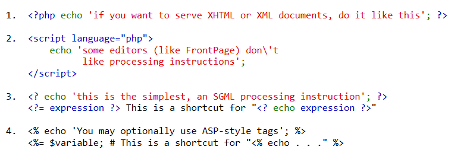
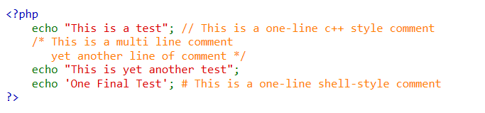

回复一下上次碰到的问题：
>1. 为什么输出`I LOVE ATD`的时候中间没有空格，原因是`没仔细看`，其实还有
>2. 为什么在`echo 'I LOVE ATD';` 可以选择不打空格，原因是`因为只有一个表达式时可以不打分号`
>3. 有关站点配置，创建的站点无法使用设置好的域名访问，原因是`你的host文件未进行修改`
>4. PHP有什么用，在无`html`的基础下，php将无法展现出语言的特性，php主要是面向服务器的，与服务器进行交互，将数据由前端传编辑修改发送到数据库
>5. 服务器是什么，这个就像高中时候`力、摩尔`一样，你学着学着就明白了，当然，也可以查看百度。简单来说，一台电脑是一台服务器
>6. 
---

### 开始于结束标记
php 有四种开始结束标记 ，这里不讲，仅做了解


在一个 PHP 代码段中的最后一行可以不用分号结束
我们一般使用的是第一种形式

### 注释
注释
 - `//`
 - `/*  */`
 - `#`


### 变量

在php中变量的表示为美元符号`$` 加上你的变量名
例如
```php
<?php
$a = 'i';
$b = 'love';
$c = 'ATD';

echo "$a $b $c";      // 输出 "i love atd"
?>
```

### 数据类型

 - Boolean 布尔类型
 - Integer 整型
 - Float 浮点型
 - String 字符串
 - Array 数组
 - Object 对象
 - NULL

### 输出语句

在 PHP 中有两个基本的输出方式： echo 和 print
区别:
 - echo - 可以输出一个或多个字符串
 - print - 只允许输出一个字符串，返回值总为 1

### 常量

设置常量的函数 `define()`的函数语法：
`bool define ( string $name , mixed $value [, bool $case_insensitive = false ] )`

 - name：必选参数，常量名称，即标志符。
 - value：必选参数，常量的值。
 - case_insensitive ：可选参数，如果设置为 TRUE，该常量则大小写不敏感。默认是大小写敏感的。

```php
<?php
define("TEST", "ATD family",FALSE);
echo TEST;  // 输出 "ATD family"
?>
```

### 基本运算

>PHP7+ 版本新增整除运算符 `intdiv()`

### 判断语句
`if` 、`if..else..`、`if..elseif..`、`switch...case..`

```php
if (condition) {
    # code...
}
```

```php

if (condition) {
    # code...
} else {
    # code...
}

```

```php
if (condition) {
    # code...
} elseif (condition) {
    # code...
}
```

```php
switch ($variable) {
    case 'value':
        # code...
        break;
    
    default:
        # code...
        break;
}
```

### 循环语句

`for`、`while`、`do..while`
```php
for ($i=0; $i < ; $i++) { 
    # code...
}
```

```php
while ($a <= 10) {
    # code...
}
```

```php
do {
    # code...
} while ($a <= 10);
```