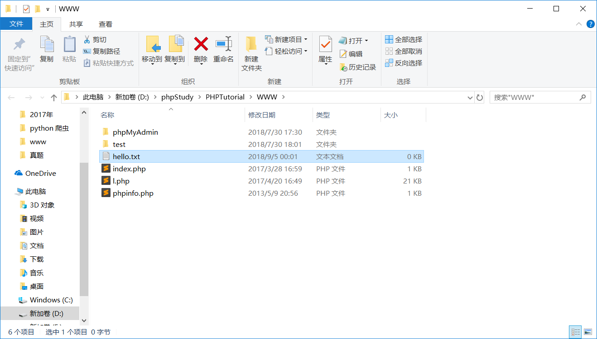
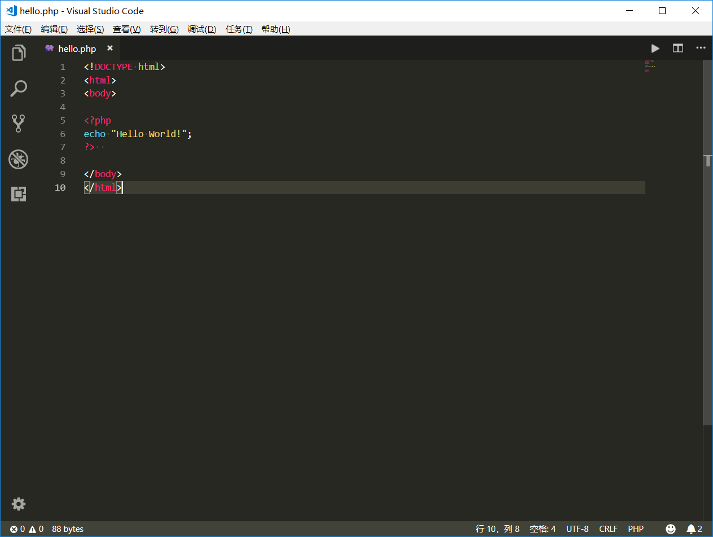

### 使用软件
 - vscode
 - phpstudy

### 下载

编辑器 Visual Studio Code 
>官网下载链接：[https://aka.ms/win32-x64-user-stable](https://aka.ms/win32-x64-user-stable)

服务器 phpstudy 
>官网下载链接：[http://phpstudy.php.cn/phpstudy/PhpStudy20180211.zip](http://phpstudy.php.cn/phpstudy/PhpStudy20180211.zip)

### 安装

略

安装过程简单，一路回车，默认配置，可以修改一下安装路径，然后ok。

#### 注意事项

安装完phpstudy 打开后可能会出现 缺少vc库

可自行对应百度下载相应的vc

附件中提供了部分vc库

ps.必须安装32位的运行库

### 使用

双击快捷键打开

emmmm 能打开就差不多了

~~关于使用 下一节再讲~~

~~可以自己摸索摸索~~

不对 应该好好的安排一下的

我们来输出一下 "helloworld"

#### 输出"helloworld"

1.首先我们打开我们的phpstudy

2.切换版本至最新版本 (方便之后的框架学习，框架使用到了7.2的新特征)


3.进入你的网站根目录


4.创建一个名为 `hello.txt`的文本文档，并将其后缀改为`.php`




5.用vscode打开 `hello.php` 文件，并编辑下列内容

```php
<!DOCTYPE html>
<html>
<body>

<?php
echo "Hello World!";
?>  

</body>
</html>
```



6.保存编辑后，打开浏览器，在地址栏输入 `http://localhost/hello.php` 


按照这样的步骤 你的 `'helloworld'` 就出来了

当前部分涉及到 `html` 具体就......再说

### 附件

[Visual Studio Code](https://www.lanzous.com/i1syd3e)
[phpstudy](https://www.lanzous.com/i1sye6d)
[缺少vc9时 x86](https://www.lanzous.com/i1sylze)
[缺少vc11时 x86](https://www.lanzous.com/i1sylsh)
[缺少vc14时 x86](https://www.lanzous.com/i1syo3a)