### 宿舍管理系统

两个网站及其所需模块
 - 用户中心网站
 >support, user-center-server
 - 选宿舍网站
 >support,user-center-client,apartment

### 准备
两个文件夹

里面有suda、public

使用phpstudy 配置两个站点 网站目都是public

进入网站刷新一下 两个文件夹都出现app文件夹

这里可以考虑将`data`文件删了....反正是数据文件，会自动更新，`app/modules/..`的`app`文件也可删了，因为用不上了
### 启动模块

**用户中心的模块**
>support, user-center-server

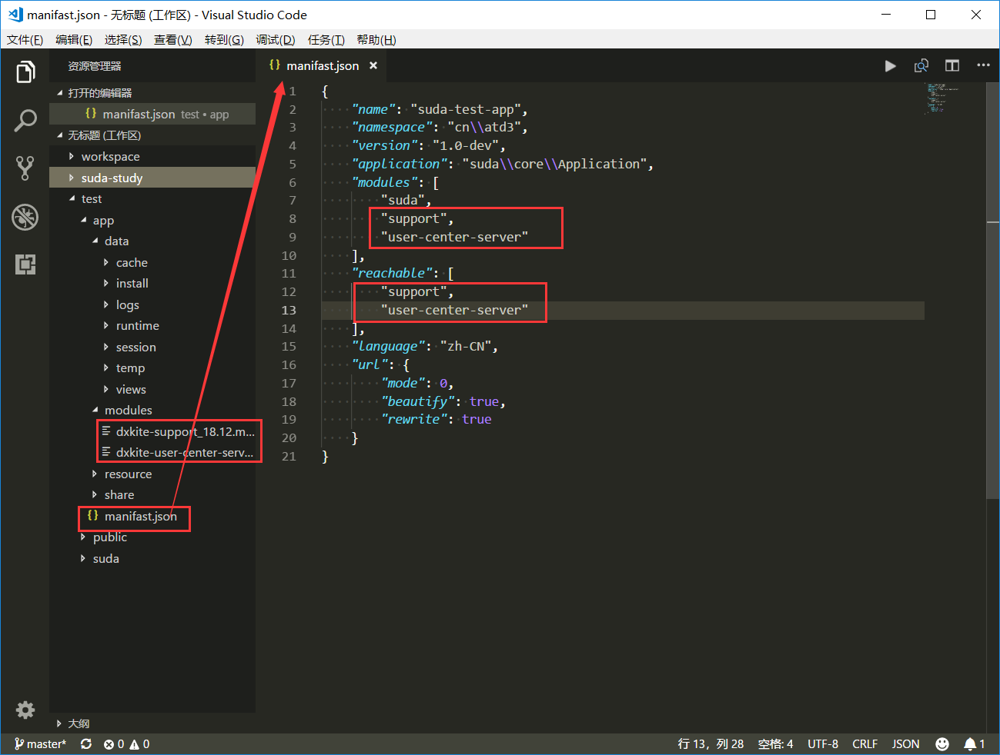

**宿舍系统的模块**
>support,user-center-client,apartment

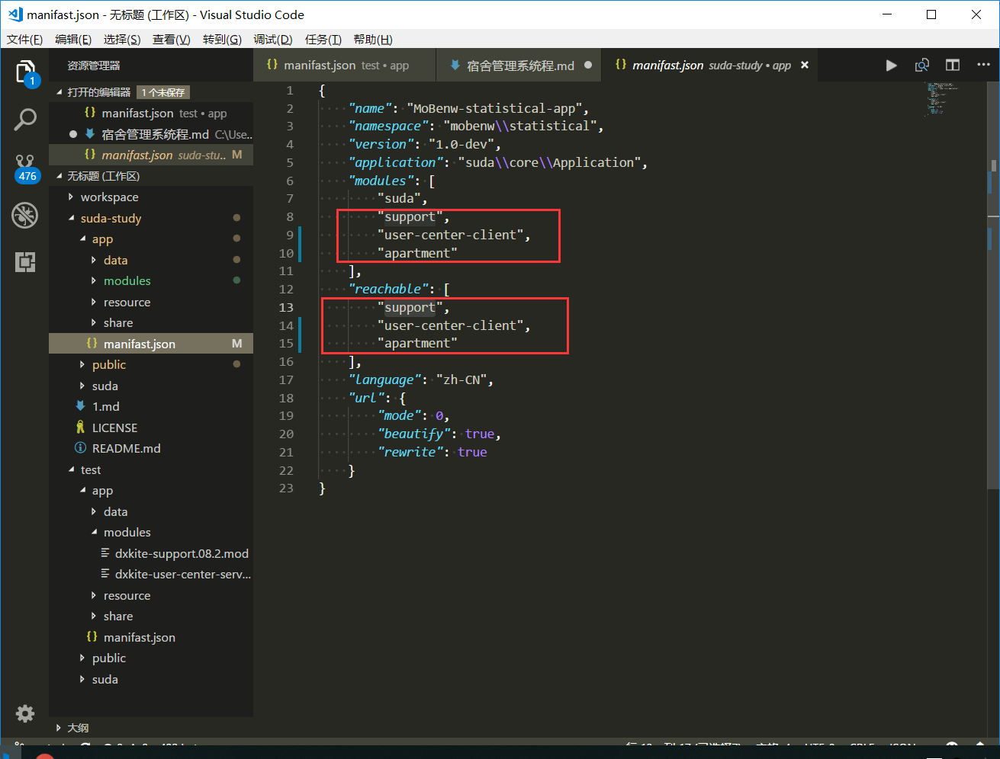

### 数据库分类
为什么分类呢 方便管理
**修改用户中心的数据库 库名看自己**
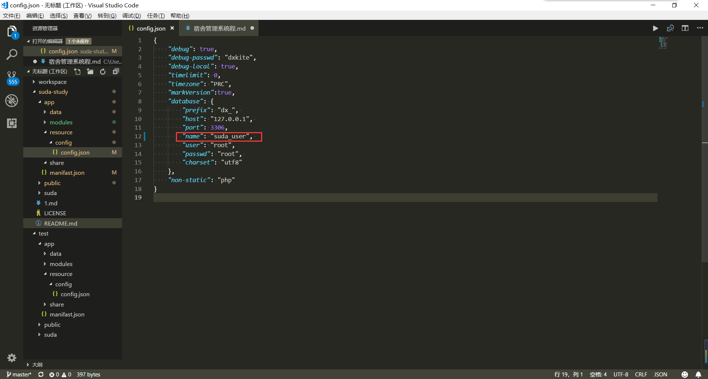

**修改宿舍系统的数据库 库名看自己**
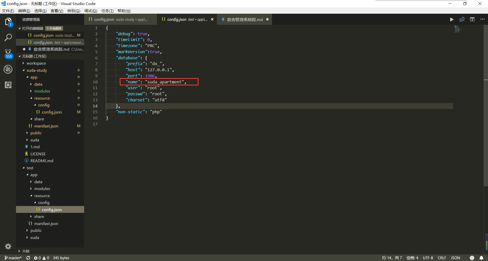

### 进入用户中心

`http://用户中心的网址/dev.php/setting`

**关于输入密码问题 mod修改后 首次进入自动登入 这里可以略了**

输入密码
管理员账号为
-u root -p root
-u dxkite -p dxkite
两个都可以
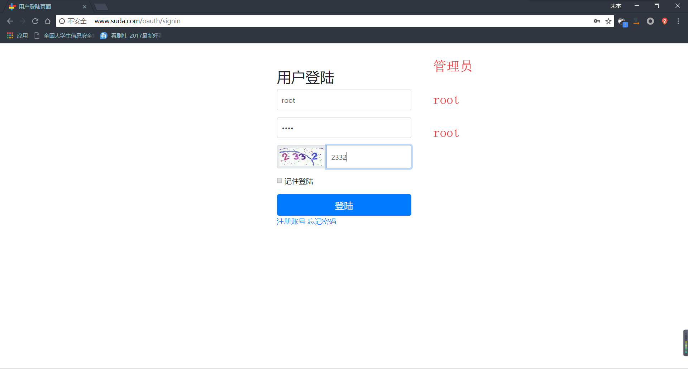
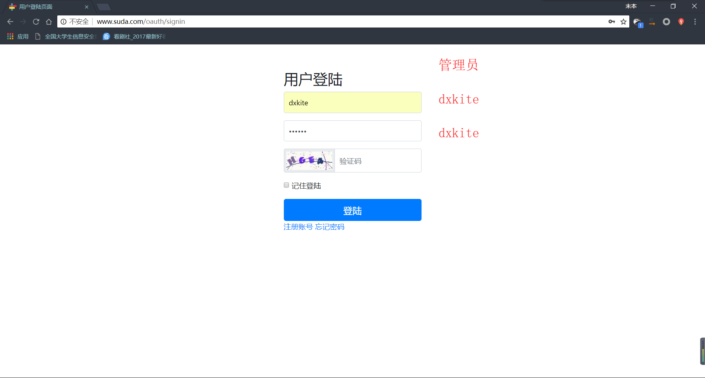

添加网站的一系列操作 把宿舍选择的那个网站添加进来

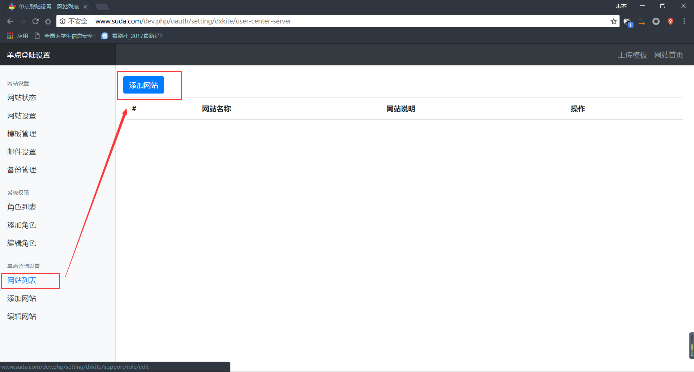

这个东西呢 在宿舍系统中可以看到 (最新mod)
```
http://选宿舍的网址/dev.php/oauth-client/callback
http://选宿舍的网址/dev.php/api/oauth/user-client
```
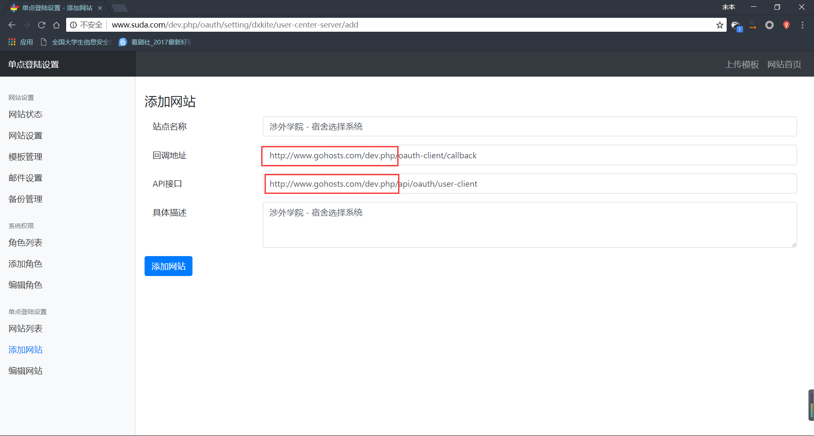
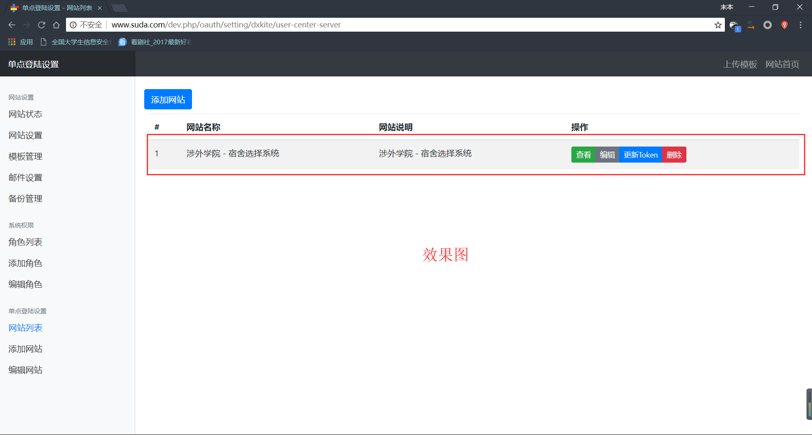
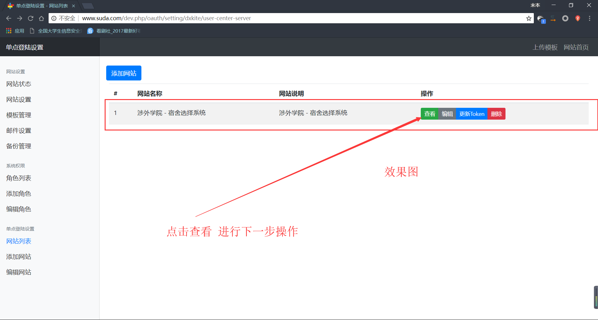
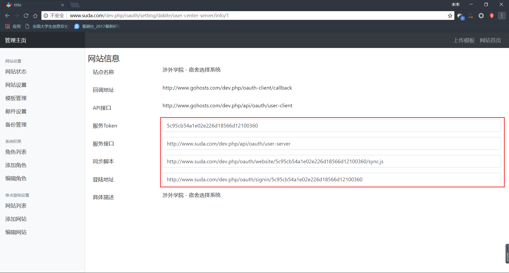


### 进入宿舍系统

`http://选宿舍的网址/dev.php/setting`


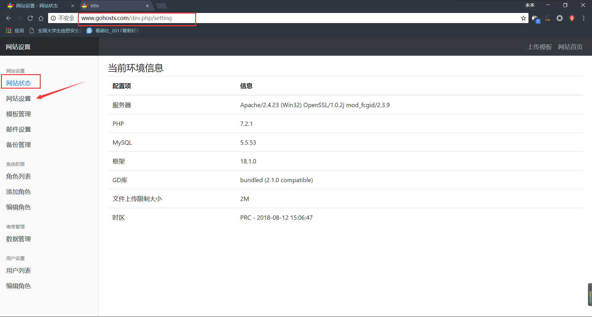

在最新mod中  这里会显示 回调地址 和API接口

修改信息，内容来自之前用户中心`网站信息` 注意点击修改
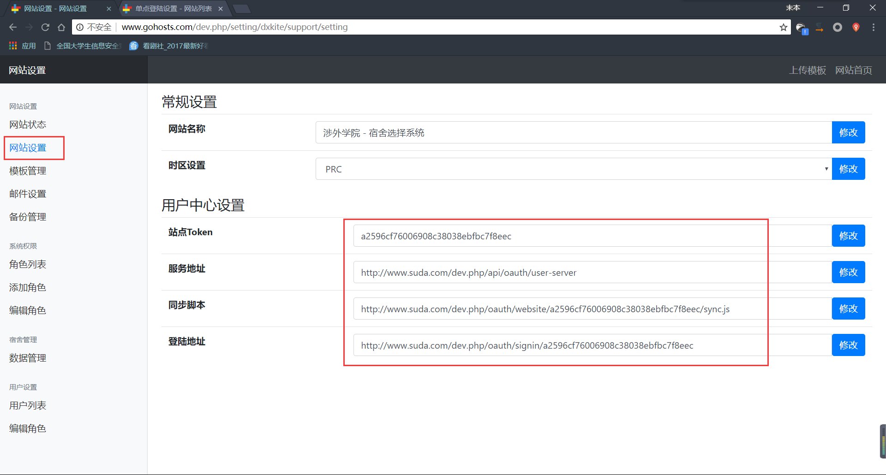

以上为这个的基本配置

导入数据 测试啊 什么什么的
就没我的事了

有关于模块之类的东西 可以去群里
也可以直接去会长大大的GitHub吧...会长的GitHub应该放了吧...啊哈哈哈我不清楚
[https://github.com/DXkite](https://github.com/DXkite)
